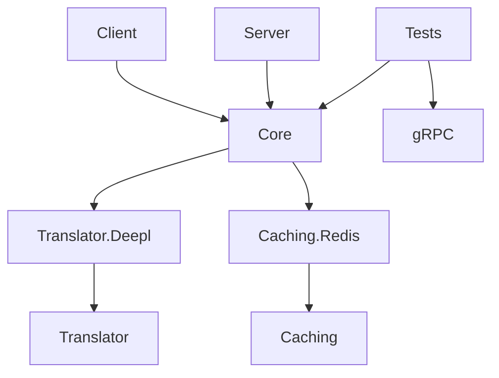

# Translations Test 2024 (Archived) 🌐🧪

[](https://github.com/Shiro-nn/translations-test-2024/stargazers)
[](https://github.com/Shiro-nn/translations-test-2024/network/members)
[](https://github.com/Shiro-nn/translations-test-2024/issues)
[](https://github.com/Shiro-nn/translations-test-2024/commits)
[](LICENSE)
[](https://github.com/Shiro-nn/translations-test-2024)


> **Translations Test 2024** — модульная система перевода текста с поддержкой кэширования и gRPC API. Проект разрабатывался в 2024 году как тестовое решение для интеграции с Deepl API и Redis. Репозиторий переведён в **архивный режим** и сохраняется как пример реализации модульной архитектуры на C#.

---

## 🧩 Основные компоненты

| Компонент          | Технологии                     | Описание                                                                 |
|--------------------|--------------------------------|--------------------------------------------------------------------------|
| **gRPC Сервер**    | ASP.NET Core, gRPC             | Предоставляет API для перевода текста и получения информации о системе  |
| **Клиент**         | .NET 8, Console App            | Консольное приложение для тестирования функциональности                 |
| **Ядро перевода**  | Deepl API, модульная архитектура | Поддержка различных движков перевода через единый интерфейс             |
| **Кэширование**    | Redis, StackExchange.Redis     | Модуль кэширования результатов перевода для ускорения работы            |
| **Тесты**          | gRPC клиент, интеграционные    | Набор тестов для проверки работы системы                                 |

---

## ⚙️ Быстрый старт

### Запуск Redis
```bash
docker-compose up -d
```

### Запуск gRPC сервера
```bash
cd Translations/Server
dotnet run
```

### Запуск клиента
```bash
cd Translations/Client
dotnet run
```

### Запуск тестов
```bash
cd Translations/Tests
dotnet run
```

---

## 🧱 Структура проекта



### Ключевые директории
- **`/Translations`** - Основное пространство решения
  - **`Core`** - Общие компоненты и интерфейсы
  - **`Server`** - gRPC сервер (порт 5232)
  - **`Client`** - Консольный клиент
  - **`Tests`** - Интеграционные тесты
  - **`Translator.Deepl`** - Реализация Deepl API
  - **`Caching.Redis`** - Реализация Redis-кэша
  - **`Initializer`** - Инициализация зависимостей

---

## 📡 gRPC API

```proto
service TranslatorProto {
  rpc Translate(TranslateRequest) returns (TranslateReply);
  rpc Information(EmptyRequest) returns (InfoReply);
}

message TranslateRequest {
  repeated string text = 1;
  string target = 2;
  string source = 3;
}

message InfoReply {
  string translator = 1;
  string caching = 2;
  int64 cacheSize = 3;
}
```

---

## ⚠️ Требования

- .NET 8 SDK
- Docker (для Redis)
- API-ключ Deepl (для работы переводчика)
- Порт 5232 (для gRPC сервера)

---

## 📜 Лицензия

Проект распространяется под лицензией **MIT**. Архив сохраняется как учебный пример модульной архитектуры и интеграции gRPC.

> Благодарю за интерес к проекту! Для современных решений рекомендую рассматривать актуальные облачные translation API.